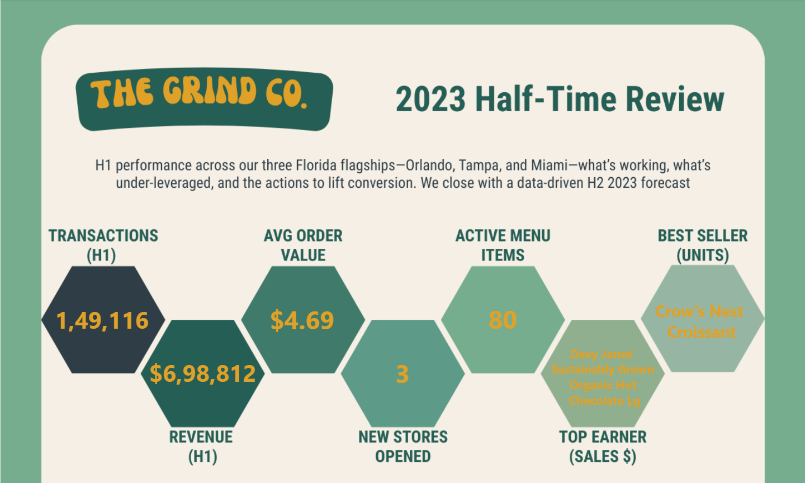
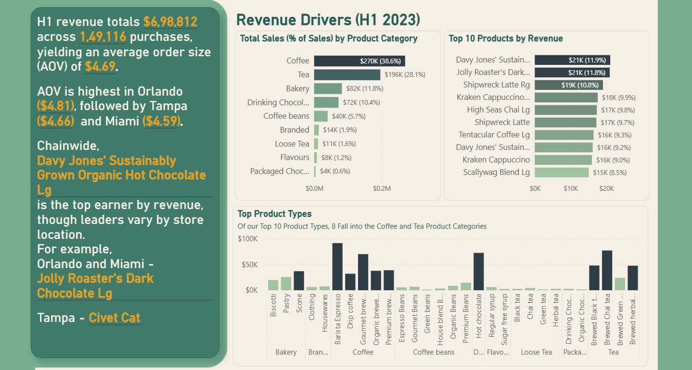
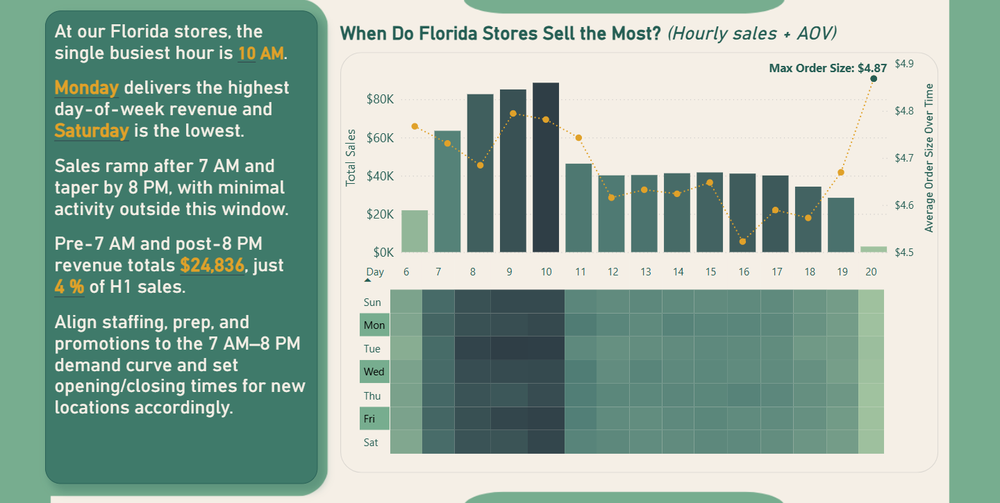
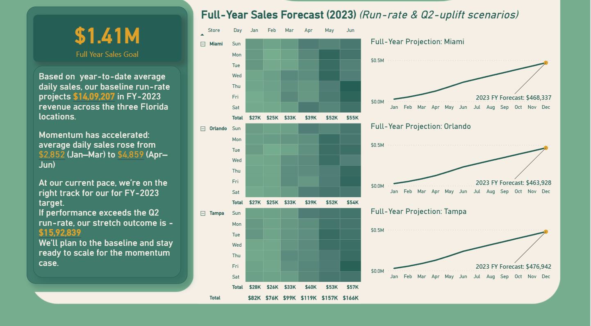

# ☕️ Coffee Sales Data Insights & Forecasting (Power BI)

A portfolio case study analyzing The Grind Co.’s coffee retail sales data with Power BI.                  
The goal: mine mid-year sales data for top products, store performance, and hourly/AOV patterns, then forecast the second half to inform staffing, inventory, and targets.

## 📌 Problem Statement  
A three-store coffee chain in Florida wants a mid-year (H1 2023) review to answer:

1. Which categories / product types / SKUs drive revenue?
2. When do stores sell the most (by hour & day, and how does AOV behave)?
3. What is our full-year 2023 outlook at current pace vs recent momentum?
4. Where are the opportunities to lift AOV, staffing efficiency, and hours?

---

## 📂 Dataset  

The dataset is a **single table** (`Coffee_sales_data`) with **transaction-level coffee sales for 2023**, containing fields such as:

* **Transaction** → `transaction_id`, `transaction_date`, `transaction_time`, `transaction_qty`, `unit_price`
* **Store** → `store_id`, `store_location` *(Orlando, Tampa, Miami)*
* **Product** → `product_id`, `product_category`, `product_type`, `product_detail`

Schema has been reshaped using **Power Query / DAX** (references only, source table load disabled):

* **Fact table** → `Coffee_Sales_Fact` 
* **Dimensions** → `Stores_Dim` (deduplicated: `store_id`, `store_location`) and `Products_Dim` (deduplicated: `product_id`, `product_category`, `product_type`, `product_detail`)
* **Date spine** → full 2023 date table for H1 slicing & FY forecasting (Month, Month Short, Day Name, etc.)
* **Type & format cleanup** → normalized date formats, enforced data types (Date, Time, Whole Number, Decimal)
---

## 📊 Insight Page (One-Page Infographic)

### **1. Cover**  

Key Metrics:
- Revenue (H1)
- Transactions (H1)
- Avg Order Value (AOV)
- Best Seller (Units)
- Top Earner (Sales $)
- Active Menu Items
- New Stores Opened

---

### **2. Revenue Drivers (H1 2023)**

Key Metrics:
- % of Sales by Category
- Top-10 Products by Share of Revenue
- Top Product Types (highlighted)

Visuals:
- Revenue mix by category 
- Top 10 products by revenue 
- Top product types

  

---

### **3. When Do Florida Stores Sell the Most? (Hourly + AOV)**

Key Metrics:
- Busiest Hour (Peak Hour)
- Highest- and Lowest-Revenue Day
- Non-Peak Sales 
- AOV Peak Hour

Visuals:
- Hourly revenue (columns) + AOV (line)
- Revenue by day of week

---

### **4. Full-Year Sales Forecast (2023)**

Key Metrics:
- Forecast (Baseline Run-Rate)
- Stretch Forecast

Visuals:
- Monthly line: Jan–Jun actuals; Jul–Dec projected
- Callouts for both forecast values

---

## 📌 Key Insights

**Overall Performance**
* Revenue **$0.69M** across **149K** purchases; **AOV $4.69**.
* AOV by store: **Orlando $4.81**, **Tampa $4.66**, **Miami $4.59**.

**Revenue Drivers**
* Category mix: **Coffee 38.6% ($270K)**, **Tea 28.1% ($196K)**, **Bakery 11.8% ($82K)** (largest three).
* **Top earner (Sales $):** *Davy Jones’ Sustainably Grown Organic Hot Chocolate Lg* (~**$21K**).

**Timing (Hourly + AOV)**

* Busiest hour: **10 AM**. **Monday** is highest-revenue; **Saturday** is lowest.
* Activity is almost entirely within **7 AM–8 PM**; pre-7 & post-8 total just **$24,836 (4%)**.
* **AOV peaks** at **$4.87** late evening.

**Forecast (FY 2023)**

* Forecast (baseline run-rate): $1.41M total (**Miami $468,337 • Orlando $463,928 • Tampa $476,942**).
* Stretch Foreacst: **$1.51M**.

---

## 📑 DAX Measures

All KPIs are built with custom DAX. Full code is in [`/dax/measures.md`](dax/measures.md).

- **Total Sales, Total Transactions (distinct), Average Order Size (AOV)**  
- **% of Sales**  
- **Product Sales Rank, Product Transaction Rank**  
- **Top Earner (Sales $), Most Popular Seller (Units)**  
- **Non-Peak Hour Sales & Non-Peak Hour Sales (%)**  
- **Forecast (baseline run-rate) and Forecast 2 (momentum/stretch)**  

---

## 🛠️ Tools & Skills Used
- Power BI Desktop — data modeling, measures, one-page infographic layout
- Power Query — reshape single source table into star schema; type cleanup & date parsing
- DAX — KPIs, rankings, time windows (hour/day), forecasting logic
- Data Storytelling & Design — narrative copy, accessible color theme, export for LinkedIn

---

## 🚀 How to Use
 
- Clone or download this repo.
- Open /pbix/report.pbix in Power BI Desktop.
- Explore the Insight Page: use store/date slicers; hover tooltips for details.
