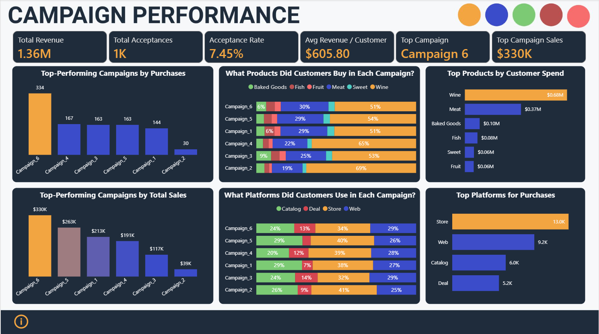
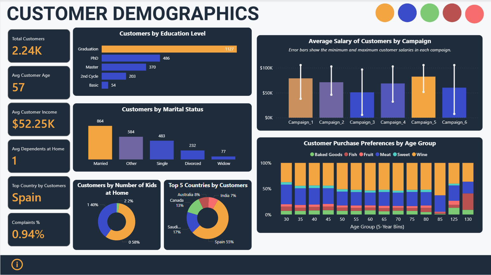
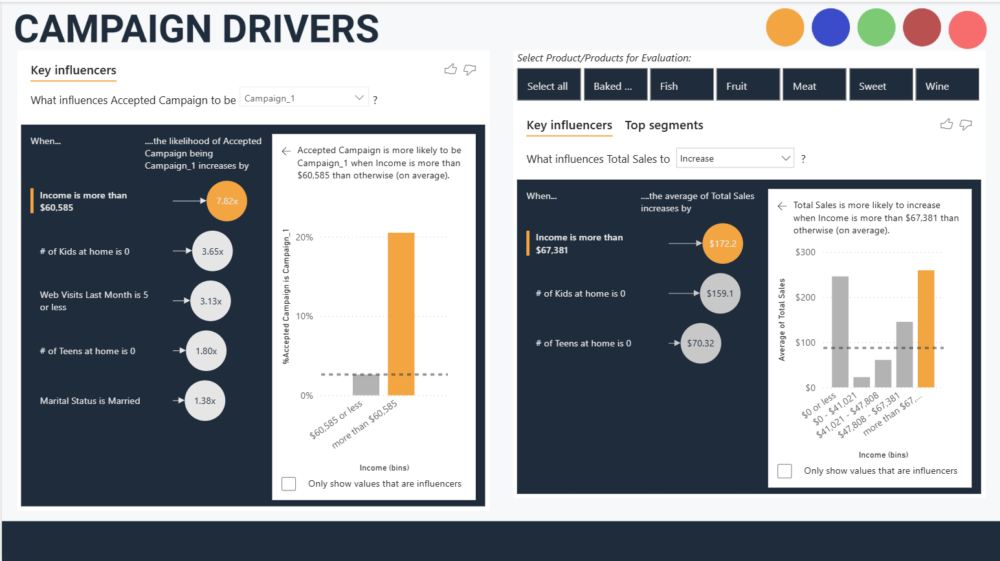

# 🛒 FreshMart Analytics – Power BI Project  

A portfolio case study analyzing marketing campaigns for a food & beverage vendor using Power BI.  
The goal: help stakeholders understand **campaign performance, customer demographics, and purchase drivers**.  

---

## 📌 Problem Statement  
FreshMart is a small company in the food & beverage industry. They want to evaluate their recent **6 marketing campaigns**, customer profiles, and purchase behavior to answer:  

1. How are our campaigns performing?  
2. Which products are customers buying?  
3. Who are our customers?  
4. What drives campaign success and customer decisions?  

---

## 📂 Dataset  

The dataset is a sample marketing dataset containing ~2,200 customers with fields such as:  

- **Customer Demographics** → Age, Education, Marital Status, Country, Household Size  
- **Campaigns** → 6 campaign response columns (accepted/not accepted)  
- **Products** → Spend on Wine, Meat, Baked Goods, Fish, Fruits, Sweets  
- **Purchases** → By Store, Web, Catalog, Deals  
- **Other** → Complaints, Enrollment Date, Recency  

Schema has been reshaped using **Power Query**:  
- Campaigns → unpivoted into long format  
- Products → unpivoted into reference table  
- Derived columns: Age, Household Size, etc.  

---

## 📊 Dashboard Pages  

### **1. Campaign Performance**  
Key Metrics:  
- Total Revenue  
- Total Acceptances  
- Acceptance Rate  
- Avg Revenue per Customer  
- Top Campaign + Sales  

Visuals:  
- Top campaigns by purchases & revenue  
- Product sales across campaigns  
- Platform usage across campaigns  
- Top products & platforms overall  

  

---

### **2. Customer Demographics**  
Key Metrics:  
- Total Customers  
- Avg Customer Age  
- Avg Customer Income  
- Avg Dependents at Home  
- Complaints %  
- Top Country by Customers  

Visuals:  
- Education & Marital Status breakdown  
- Avg Salary of Customers by Campaign (with error bars)  
- Top 5 Countries by Customers  
- Customer Purchase Preferences by Age  

  

---

### **3. Campaign Drivers**  
Uses the **Key Influencers visual** in Power BI to uncover what drives campaign acceptance and total sales.  

- Income and Age are the strongest predictors of campaign success  
- Customers with higher income and fewer dependents were more likely to accept offers  
- Store remains the strongest sales channel, but Web is growing  

  

---

## 📌 Key Insights  

### Campaign Performance  
- **Campaign 6** was the **top performer** in both purchases (334) and revenue ($0.33M).  
- Campaigns **3 & 5 had equal purchases**, but **Campaign 5 drove higher revenue** → better product/customer mix.  
- **Wine** was the most purchased and the top revenue generator ($0.68M).  
- **In-store purchases dominated** (13K purchases), followed by Web.  

### Customer Demographics  
- Most customers are **married college graduates**.  
- Average customer is **57 years old** with ~1 dependent at home.  
- **Spain** contributes the largest share of customers (~55%).  
- **Wine sales increase with age**, confirming older customers spend more on wine.  
- Only **0.94% of customers complained** → high satisfaction levels.  

### Customer Persona  
> A typical customer is a **57-year-old married graduate based in Spain**,  
> with ~1 dependent at home and a **strong preference for wine**.  

---

## 📑 DAX Measures  

All KPIs were built with custom DAX. Full code is available in [`/dax/measures.md`](dax/measures.md). 

Key measures include:  
- **Total Revenue**  
- **Total Campaign Acceptances**  
- **Campaign Acceptance Rate**  
- **Average Revenue per Customer**  
- **Avg Dependents at Home**  
- **Complaints %**  
- **Best Campaign & Sales**  
- **Top Country**  

---

## 🛠️ Tools & Skills Used  

- **Power BI Desktop (2025)** – data modeling, measures, dashboards  
- **Power Query** – data shaping, unpivoting, date calculations  
- **DAX** – KPIs, campaign metrics, customer insights  
- **Data Storytelling** – building insights and customer persona  

---

## 🚀 How to Use  

1. Clone or download this repo.  
2. Open **FreshMart-Analytics.pbix** in Power BI Desktop.  
3. Explore the report pages and slicers.  

---

## 📌 Files in Repo  

```
FreshMart-PowerBi-Campaign-Analytics/             
│        
├─ FreshMart-Analytics.pbix # Power BI project file                 
├─ README.md # Project documentation                  
├─ dax/              
│ └─ measures.md # All DAX formulas with explanations              
└─ screenshots/               
├─ 01_campaign_performance.png            
├─ 02_customer_demographics.png               
└─ 03_campaign_drivers.png             
```

---

## 📢 Author  

👩‍🎨 **Ansh Mathur** – Software Engineer               
🌐 LinkedIn: [Connect with me on LinkedIn](https://www.linkedin.com/in/ansh-mathur-4b8a58201/) 
---
